# 💻 Development Guide

Development workflow and best practices for the Troop Manager application.

## 🚀 Quick Start

```bash
# Start development server (recommended)
./run.sh dev --skip-tests

# Start with full testing
./run.sh dev

# Run tests only
./run.sh tests

# Visit http://localhost:3030
```

## 📁 Project Structure

### Source Code Organization
```
src/
├── components/          # Reusable React components
│   ├── SimpleEmailTest.js
│   ├── SimpleCalendarTest.js
│   └── __tests__/       # Component tests
├── pages/              # Application pages/routes
│   ├── Dashboard.js
│   ├── Settings.js
│   └── ...
├── services/           # Business logic & API calls
│   ├── googleCalendarService.js
│   ├── googleDriveService.js
│   ├── authService.js
│   └── __tests__/      # Service tests
├── firebase.js         # Firebase configuration
└── App.js             # Main application component
```

### Key Directories
- **`components/`** - Reusable UI components
- **`pages/`** - Top-level page components
- **`services/`** - API integrations and business logic
- **`__tests__/`** - Test files (co-located with source)

## 🛠️ Run Script Usage

The `run.sh` script is the main entry point for all development, testing, and deployment operations.

### Available Commands

```bash
# Development
./run.sh dev                    # Start dev server with tests
./run.sh dev --skip-tests       # Start dev server without tests

# Production
./run.sh prod                   # Deploy to production with tests
./run.sh prod --skip-tests      # Deploy to production without tests

# Testing
./run.sh tests                  # Run comprehensive test suite only

# Help
./run.sh --help                 # Show usage information
```

### NPM Script Aliases

For convenience, these npm scripts are available:

```bash
npm run dev                     # → ./run.sh dev
npm run dev:skip-tests          # → ./run.sh dev --skip-tests
npm run deploy                  # → ./run.sh prod
npm run deploy:skip-tests       # → ./run.sh prod --skip-tests
npm run test:all                # → ./run.sh tests
```

### Script Features

- **🔍 Prerequisites Check** - Validates Node.js, npm, and dependencies
- **🧪 Comprehensive Testing** - Runs all tests with coverage analysis
- **🔧 Linting Integration** - ESLint validation before deployment
- **🚀 Smart Deployment** - Firebase hosting with build optimization
- **📊 Detailed Output** - Progress indicators and status messages
- **⚠️ Error Handling** - Graceful failure with helpful error messages

## 🔄 Development Workflow

### 1. Feature Development
```bash
# Create feature branch
git checkout -b feature/your-feature

# Start development server
./run.sh dev --skip-tests

# Make changes in src/
# Test changes in browser
```

### 2. Testing
```bash
# Run specific test categories
npm run test:components     # UI components
npm run test:services       # Business logic
npm run test:integration    # API integration

# Run all tests
./run.sh tests

# Interactive testing
npm test
```

### 3. Quality Checks
```bash
# Lint code
npm run lint

# Run full test suite with coverage
npm run test:coverage
```

### 4. Deployment
```bash
# Deploy with full validation
npm run deploy

# Quick deploy (skip tests)
./run.sh prod --skip-tests
```

## 🧪 Testing Strategy

### Test Categories
- **Component Tests** (23) - UI functionality and user interactions
- **Service Tests** (16) - Business logic and data processing
- **Integration Tests** (15) - API calls and workflows
- **Infrastructure Tests** (10) - Test environment validation

### Writing Tests
```javascript
// Component test example
import { renderWithProviders, mockFetchSuccess } from '../testing/testUtils';
import MyComponent from '../MyComponent';

describe('MyComponent', () => {
  it('should render correctly', () => {
    renderWithProviders(<MyComponent />);
    expect(screen.getByText('Expected Text')).toBeInTheDocument();
  });
});
```

### Test Utilities
Located in `testing/testUtils.js`:
- `renderWithProviders()` - Render with React providers
- `mockFetchSuccess()` / `mockFetchError()` - Mock API responses
- Mock data: `mockUser`, `mockCalendarEvent`, `mockEmail`

## 🔧 Common Tasks

### Adding New Components
1. Create component in `src/components/YourComponent.js`
2. Create test file `src/components/__tests__/YourComponent.test.js`
3. Import and use in pages or other components

### Adding New Pages
1. Create page in `src/pages/YourPage.js`
2. Add route in `src/App.js`
3. Add navigation link if needed

### API Integration
1. Create service in `src/services/yourService.js`
2. Create test file `src/services/__tests__/yourService.test.js`
3. Use service in components

### Google Drive Integration Development

The application includes a comprehensive Google Drive integration for image uploads that works seamlessly with rich text editors.

#### Architecture Overview
- **Frontend**: `googleDriveService.js` handles uploads and CORS issues
- **Backend**: Google Apps Script proxy manages Drive API calls
- **Storage**: Images stored in Google Drive with public access
- **Editor Integration**: Blob URLs created for CORS-free editor embedding

#### Key Components

**GoogleDriveService (`src/services/googleDriveService.js`)**
- `uploadImage(file, fileName)` - Upload image to Drive via proxy
- `getImageAsBase64(imageUrl)` - Fetch image data as base64
- `getImageInfo(imageUrl)` - Get image metadata
- `convertToEditorUrl(proxyUrl)` - Convert proxy URL to blob URL
- `deleteImage(imageUrl)` - Delete image from Drive

#### Development Workflow

**Testing Image Uploads:**
```bash
# Test Google Drive integration
npm test -- --testNamePattern="GoogleDriveService"

# Manual testing in browser
# 1. Start dev server: npm run dev:skip-tests
# 2. Navigate to a page with image upload
# 3. Upload an image and check console logs
# 4. Verify image appears in your Google Drive
```

**Debugging CORS Issues:**
```javascript
// Enable verbose logging in googleDriveService.js
console.log('Upload result:', result);
console.log('Converting to editor URL:', proxyUrl);
console.log('Created blob URL:', blobUrl);
```

**Google Apps Script Development:**
1. Make changes to your Apps Script code
2. Save the script (auto-deploys to existing web app)
3. Test changes immediately - no re-deployment needed
4. Check Apps Script execution logs for server-side debugging

#### Common Development Tasks

**Adding New Image Upload Features:**
1. Import `googleDriveService` in your component
2. Use `uploadImage()` method with file input
3. Handle the returned URL (already editor-compatible)
4. Add error handling for upload failures

**Handling Different Image Formats:**
```javascript
// Service automatically detects MIME types
const supportedTypes = ['image/jpeg', 'image/png', 'image/gif', 'image/webp'];
const isSupported = file.type && supportedTypes.includes(file.type);
```

**Editor Integration:**
```javascript
// For rich text editors expecting direct image URLs
const editorUrl = await googleDriveService.uploadImage(file);
// editorUrl is already a blob URL that works with any editor

// For manual blob URL conversion (if needed)
const blobUrl = await googleDriveService.convertToEditorUrl(proxyUrl);
```

#### Environment Variables for Development

```env
# Required for Google Drive integration
REACT_APP_GOOGLE_DRIVE_PROXY_URL=https://script.google.com/macros/s/YOUR_SCRIPT_ID/exec

# Optional: Set to 'development' for verbose logging
NODE_ENV=development
```

#### Troubleshooting Common Issues

**Image Upload Fails:**
- Check Google Apps Script execution logs
- Verify proxy URL is correct in `.env`
- Ensure Apps Script has proper permissions
- Check file size limits (10MB default)

**Images Don't Display in Editor:**
- Check browser console for CORS errors
- Verify blob URL generation is working
- Test with `?format=json` parameter manually
- Check if editor supports blob URLs

**CORS Errors:**
- Ensure Apps Script returns proper CORS headers
- Check if `createCORSResponse()` function is used
- Verify editor is using blob URLs, not direct Drive URLs
- Test proxy URL manually in browser

#### Performance Considerations

**Image Optimization:**
- Resize large images before upload
- Use appropriate image formats (WebP when supported)
- Consider thumbnail generation for large galleries

**Caching Strategy:**
```javascript
// Blob URLs are automatically cached by browser
// For persistent caching, store URLs in localStorage
localStorage.setItem(`image_${fileId}`, blobUrl);
```

**Rate Limiting:**
- Google Apps Script has built-in rate limiting
- Implement client-side upload queuing for multiple files
- Show progress indicators for large uploads

#### Automatic Image Cleanup

The system automatically cleans up unused images from Google Drive when outing plans are saved:

**How It Works:**
1. **Track Original Content**: When editing existing outings, original content is stored for comparison
2. **Compare on Save**: When saving, the system compares original vs. new content to identify removed images
3. **Auto-Delete**: Unused images are automatically deleted from Google Drive
4. **Error Handling**: Cleanup errors don't prevent saving; they're logged for debugging

**Key Features:**
- **Automatic**: No manual intervention required
- **Safe**: Only affects images that were actually removed from content
- **Non-blocking**: Cleanup failures don't prevent document saves
- **Comprehensive**: Scans all rich text fields (overview, detail, notes, etc.)

**Methods Available:**
```javascript
// Automatic cleanup (used internally)
await googleDriveService.cleanupUnusedImages(oldContent, newContent);

// Extract images from content
const images = googleDriveService.extractImageUrlsFromContent(htmlContent);

// Bulk cleanup placeholder (for future implementation)
await googleDriveService.bulkCleanupOrphanedImages(allContentArray);
```

**Benefits:**
- **Storage Efficiency**: Prevents accumulation of unused images
- **Cost Management**: Reduces Google Drive storage usage
- **Maintenance-Free**: Automatic cleanup without user intervention

### Environment Variables
Add to `.env` file:
```env
REACT_APP_YOUR_VARIABLE=value
```

Access in code:
```javascript
const value = process.env.REACT_APP_YOUR_VARIABLE;
```

## 🎯 Best Practices

### Code Organization
- Keep components small and focused
- Use services for API calls and business logic
- Co-locate tests with source files
- Use meaningful file and function names

### Testing
- Write tests for new features
- Maintain 100% test pass rate
- Use descriptive test names
- Mock external dependencies

### Git Workflow
```bash
# Feature development
git checkout -b feature/description
# Make changes
git add .
git commit -m "feat: description"
git push origin feature/description

# Create pull request
# After review and merge
git checkout main
git pull origin main
```

### Performance
- Use React.memo for expensive components
- Lazy load pages with React.lazy()
- Optimize images and assets
- Monitor bundle size

## 🔍 Debugging

### Development Tools
- React Developer Tools browser extension
- Redux DevTools (if using Redux)
- Firebase console for backend debugging
- Browser network tab for API calls

### Common Issues
- **Port conflicts**: Use `PORT=3001 npm start`
- **Environment variables**: Restart server after changes
- **Firebase auth**: Check console for auth errors
- **API calls**: Check network tab and server logs

### Debug Commands
```bash
# Debug tests
npm run test:debug

# Verbose logging
DEBUG=* npm start

# Check bundle size
npm run build
npx serve -s build
```

## 📊 Code Quality

### Linting
```bash
# Run ESLint
npm run lint

# Fix auto-fixable issues
npm run lint:fix
```

### Testing Coverage
```bash
# Generate coverage report
npm run test:coverage

# View coverage report
open coverage/lcov-report/index.html
```

### Performance Monitoring
- Monitor build times
- Check bundle size after changes
- Profile components with React DevTools
- Monitor Firebase usage

## 🚀 Deployment Preparation

Before deploying:
1. Run full test suite: `./run.sh tests`
2. Check linting: `npm run lint`
3. Test build: `npm run build`
4. Review changes in staging environment

## 🔐 Authentication & Token Management

### Authentication Flow Overview

The application uses Firebase Authentication with a custom user management system that includes secure token-based flows for user registration and password reset. The system supports both Google OAuth and email/password authentication methods.

## 🔄 Complete Authentication Flows

### 1. User Registration & Account Setup Flow

#### **Step 1: Registration Request**
```
User Action: Fill out registration form
Location: /register
Data: Scout + Parent information (names, emails, phone, etc.)
```

**Process:**
- User submits registration form with family information
- System creates user documents directly in `users` collection
- All users start with `accessStatus: 'pending'`
- System assigns `familyId` to group family members

**Database Changes:**
```javascript
// Creates documents in 'users' collection
{
  email: "scout@example.com",
  accessStatus: "pending",     // Awaiting admin approval
  scoutingStatus: "Registered", // Active in troop
  familyId: "family_1234567890",
  // ... other user data
}
```

#### **Step 2: Admin Review & Approval**
```
Admin Action: Review pending users in Users page
Location: /users → "Pending Requests" tab
```

**Process:**
- Admin sees users with `accessStatus: 'pending'`
- Admin clicks "Approve" button for each user
- System updates `accessStatus: 'pending'` → `'approved'`
- System generates secure `newUserTokens` (24-hour expiry)
- System sends invitation emails to approved users

**Database Changes:**
```javascript
// Updates user document
{ accessStatus: "approved" }

// Creates token document
{
  token: "secure-random-token",
  email: "user@example.com", 
  expiresAt: timestamp + 24hours,
  used: false
}
```

#### **Step 3: Invitation Email**
```
System Action: Send setup emails to approved users
Email Type: Account Setup Invitation
```

**Email Content:**
- **Gmail users**: "Continue with Google" + optional password setup
- **Non-Gmail users**: Password setup instructions
- **Setup Link**: `/account-setup?email=user@example.com&token=abc123`
- **Token Expiry**: 24 hours

#### **Step 4: Account Setup Completion**
```
User Action: Click email link → Complete account setup
Location: /account-setup
```

**Gmail Users Process:**
1. Click "Continue with Google" → Google OAuth flow
2. System calls `signInWithGoogleForAccountSetup()`
3. System migrates email-based user doc to UID-based doc
4. System cleans up old email-based doc and tokens
5. **Result**: Redirect to dashboard (logged in)

**Non-Gmail Users Process:**
1. Enter password twice → Password strength validation
2. System calls `completeNewUserRegistration()`
3. System creates Firebase Auth account with email/password
4. System updates user document and cleans up tokens
5. **Result**: Redirect to dashboard (logged in)

### 2. Password Reset Flow

#### **Step 1: Forgot Password Request**
```
User Action: Click "Forgot Password?" on login page
Location: /login → Forgot Password view
```

**Process:**
- User enters email address
- System validates email exists in users collection
- System generates secure `passwordResetTokens` (1-hour expiry)
- System sends reset email via Google Apps Script webhook

**Database Changes:**
```javascript
// Creates token document
{
  token: "secure-random-token",
  email: "user@example.com",
  expiresAt: timestamp + 1hour,
  used: false,
  purpose: "password_reset"
}
```

#### **Step 2: Reset Email Delivery**
```
System Action: Send password reset email
Email Type: Password Reset Request
```

**Email Content:**
- Reset instructions
- **Reset Link**: `/reset-password?mode=customReset&token=xyz789&email=user@example.com`
- **Token Expiry**: 1 hour
- **Security Note**: Link is single-use

#### **Step 3: Password Reset Completion**
```
User Action: Click email link → Enter new password
Location: /reset-password
```

**Process:**
1. System validates token and email
2. User enters new password twice
3. System performs security validations:
   - Password strength requirements
   - Compromised password check (HaveIBeenPwned API)
   - Rate limiting protection
4. System handles based on user type:
   - **Google Users**: Shows message to use Google Login
   - **Regular Users**: Completes password reset
5. System marks token as used and cleans up other tokens
6. **Result**: Success message → Redirect to login

### 3. Regular Login Flow

#### **Google Login**
```
User Action: Click "Sign in with Google"
Location: /login
```

**Process:**
1. Google OAuth popup → User selects account
2. System calls `signInWithGoogle()`
3. System validates user has `accessStatus: 'approved'`
4. System cleans up any pending password reset tokens
5. **Result**: Redirect to dashboard

#### **Email/Password Login**
```
User Action: Enter email + password → Click "Sign In"
Location: /login
```

**Process:**
1. Firebase Authentication validates credentials
2. System calls `signIn(email, password)`
3. System validates user has `accessStatus: 'approved'`
4. System cleans up any pending password reset tokens
5. **Result**: Redirect to dashboard

## 📊 Visual Flow Diagrams

### Registration & Account Setup Flow

```mermaid
graph TD
    A["👤 User Fills Registration Form<br/>/register"] --> B["📝 System Creates Users<br/>accessStatus: 'pending'"]
    B --> C["⏳ Admin Reviews Pending Users<br/>/users → Pending Requests"]
    C --> D{"🔍 Admin Decision"}
    D -->|Approve| E["✅ Update accessStatus: 'approved'<br/>Generate newUserTokens"]
    D -->|Reject| F["❌ Update accessStatus: 'rejected'<br/>Send rejection notice"]
    E --> G["📧 Send Invitation Emails<br/>Setup links with tokens"]
    G --> H{"📱 User Email Type?"}
    H -->|Gmail| I["🔵 Google Login Option<br/>+ Password Setup Option"]
    H -->|Non-Gmail| J["🔑 Password Setup Only"]
    I --> K["🔵 Click 'Continue with Google'"]
    I --> L["🔑 Click 'Set Password'"]
    J --> L
    K --> M["🔐 signInWithGoogleForAccountSetup()<br/>Migrate to UID-based doc"]
    L --> N["🔐 completeNewUserRegistration()<br/>Create Firebase Auth account"]
    M --> O["🏠 Redirect to Dashboard<br/>✅ Logged In"]
    N --> O
    F --> P["📧 Send Rejection Email<br/>❌ End Process"]
```


### Password Reset Flow

```mermaid
graph TD
    A["🔐 User Clicks 'Forgot Password?'<br/>/login"] --> B["📧 Enter Email Address"]
    B --> C["🔍 System Validates Email<br/>Check users collection"]
    C --> D{"✅ Email Found?"}
    D -->|No| E["❌ Error: 'No account found'"]
    D -->|Yes| F["🎫 Generate passwordResetToken<br/>1-hour expiry"]
    F --> G["📧 Send Reset Email<br/>via Google Apps Script"]
    G --> H["📬 User Receives Email<br/>Reset link with token"]
    H --> I["🔗 Click Reset Link<br/>/reset-password?mode=customReset"]
    I --> J["🔑 Enter New Password Twice"]
    J --> K["🛡️ Security Validations<br/>• Strength check<br/>• Breach detection<br/>• Rate limiting"]
    K --> L{"🔍 User Type Check"}
    L -->|Google User| M["🔵 Show Google Login Message<br/>'Use Google Login instead'"]
    L -->|Regular User| N["✅ Complete Password Reset<br/>Mark token as used"]
    N --> O["🏠 Redirect to Login<br/>✅ Success Message"]
    M --> P["🔵 Redirect to Login<br/>Use Google Login"]
    E --> Q["🔄 Stay on Form<br/>Try different email"]
```


### Regular Login Flow

```mermaid
graph TD
    A["🏠 User Visits Login Page<br/>/login"] --> B{"🔐 Login Method?"}
    B -->|Google| C["🔵 Click 'Sign in with Google'"]
    B -->|Email/Password| D["📧 Enter Email + Password"]
    C --> E["🔐 Google OAuth Popup<br/>Select Google account"]
    D --> F["🔐 Firebase Authentication<br/>Validate credentials"]
    E --> G["🔍 signInWithGoogle()<br/>Check accessStatus"]
    F --> H["🔍 signIn(email, password)<br/>Check accessStatus"]
    G --> I{"✅ Access Status?"}
    H --> I
    I -->|approved| J["🧹 Clean up password reset tokens<br/>Mark as used: 'successful_login'"]
    I -->|pending| K["⏳ Error: 'Account pending approval'"]
    I -->|rejected/retired| L["❌ Error: 'Access revoked'"]
    J --> M["🏠 Redirect to Dashboard<br/>✅ Successfully Logged In"]
    K --> N["📧 Contact Administrator<br/>❌ Stay on Login"]
    L --> N
```


## 🔒 Security Features & Error Handling

### Token Security
- **Secure Generation**: Cryptographically secure random tokens
- **Expiration**: Short-lived tokens (1-24 hours)
- **Single Use**: Tokens automatically invalidated after use
- **Rate Limiting**: Prevents brute force attacks
- **Cleanup**: Automatic cleanup of expired/used tokens

### Password Security
- **Strength Validation**: Enforces strong password requirements
- **Breach Detection**: Checks against HaveIBeenPwned database
- **Secure Storage**: Firebase handles password hashing/salting

### Error Scenarios & Handling

#### **Registration Errors**
```javascript
// Duplicate email
"User with this email already exists"

// Invalid email format  
"Please enter a valid email address"

// Missing required fields
"All required fields must be filled"
```

#### **Account Setup Errors**
```javascript
// Expired token
"This setup link has expired. Please contact an administrator."

// Invalid token
"Invalid setup link. Please check your email for the correct link."

// Email already in use (Firebase)
"This email is already registered. The system will sign you in instead."

// Google sign-in failed
"Google sign-in failed. Please try again or use password setup."
```

#### **Password Reset Errors**
```javascript
// User not found
"No account found with this email address"

// Weak password
"Password requirements not met: [specific issues]"

// Compromised password
"This password has been found in X data breaches. Please choose a different password."

// Rate limit exceeded
"Too many attempts. Please wait before trying again."

// Google user attempting password reset
"You are using Google Login for this account. No password reset is needed."
```

#### **Login Errors**
```javascript
// Invalid credentials
"Invalid email or password"

// User not approved
"Your account is pending approval. Please contact an administrator."

// User rejected/retired
"Your account access has been revoked. Please contact an administrator."
```

## 🧪 Authentication Flow Testing

### Test Suite Overview

The authentication flow test suite provides comprehensive coverage of all user authentication workflows. Tests are located in `src/__tests__/integration/authenticationFlows.test.js`.

### Running Authentication Tests

```bash
# Run all authentication flow tests
./testing/auth-flow-tests.sh

# Run specific test categories
npm test -- --testNamePattern="Registration & Account Setup"
npm test -- --testNamePattern="Password Reset Flow"
npm test -- --testNamePattern="Regular Login Flow"

# Run with coverage
npm test -- src/__tests__/integration/authenticationFlows.test.js --coverage
```

### Test Categories

#### **1. Registration & Account Setup Flow Tests**
- ✅ Registration form submission and validation
- ✅ Auto-generation of preferred names
- ✅ Admin approval workflow
- ✅ Google account setup for Gmail users
- ✅ Password setup for non-Gmail users
- ✅ Token validation and expiration handling

#### **2. Password Reset Flow Tests**
- ✅ Password reset request validation
- ✅ Email delivery and token generation
- ✅ Password reset completion
- ✅ Google user detection and messaging
- ✅ Password strength validation
- ✅ Compromised password detection

#### **3. Regular Login Flow Tests**
- ✅ Google OAuth login
- ✅ Email/password authentication
- ✅ User status validation (pending/approved/rejected)
- ✅ Error handling for invalid credentials

#### **4. Token Cleanup Integration Tests**
- ✅ Password reset token cleanup on login
- ✅ New user token cleanup on registration completion
- ✅ Expired token cleanup
- ✅ Cross-token invalidation

#### **5. Error Boundary Tests**
- ✅ Network error handling
- ✅ Rate limiting protection
- ✅ Invalid token scenarios
- ✅ Graceful degradation

### Test Utilities

The test suite includes helper functions for common scenarios:

```javascript
// Create mock user data
const mockUser = createMockUser({
  email: 'test@example.com',
  accessStatus: 'pending'
});

// Create mock tokens
const mockToken = createMockToken({
  email: 'test@example.com',
  expiresAt: new Date(Date.now() + 24 * 60 * 60 * 1000)
});

// Mock all auth service methods
mockAuthServiceMethods();
```

### Coverage Goals

The test suite aims for:
- **90%+ line coverage** on authentication-related code
- **100% scenario coverage** for critical user flows
- **Edge case testing** for security vulnerabilities

### Test Data Management

Tests use:
- **Isolated mocks** - No real Firebase calls
- **Deterministic data** - Consistent test results
- **Cleanup hooks** - Reset state between tests
- **Error simulation** - Test failure scenarios

### **User Status Fields**

The system uses two distinct status fields to track different aspects of user state:

#### **Status Fields Quick Reference**

| **Field** | **Purpose** | **Controls** | **Possible Values** |
|-----------|-------------|--------------|-------------------|
| `accessStatus` | System Access | Who can log in | `pending`, `approved`, `rejected`, `retired` |
| `scoutingStatus` | Troop Membership | Participation level | `Registered`, `Inactive`, `Dropped`, `AgeOut` |

#### **Access Status** (System/Account Level)
Controls user access to the application:
- `'pending'` - Waiting for admin approval
- `'approved'` - Admin has approved access to the system
- `'rejected'` - Admin has rejected the access request
- `'retired'` - User has left the system (historical record)

#### **Scouting Status** (Troop Membership Level)
Tracks the user's status within the troop:
- `'Registered'` - Active member of the troop
- `'Inactive'` - Temporarily not participating in activities
- `'Dropped'` - Has left the troop
- `'AgeOut'` - Has aged out of the scouting program

#### **Status Field Usage Examples**

The two status fields work independently to provide flexible user management:

**Scenario 1: New Scout Approved**
```javascript
{
  accessStatus: 'approved',    // Can log into system
  scoutingStatus: 'Registered' // Active troop member
}
```

**Scenario 2: Scout Taking a Break**
```javascript
{
  accessStatus: 'approved',    // Can still log in to view information
  scoutingStatus: 'Inactive'   // Not participating in activities
}
```

**Scenario 3: Scout Who Left the Troop**
```javascript
{
  accessStatus: 'retired',     // No longer has system access
  scoutingStatus: 'Dropped'    // Left the troop
}
```

**Scenario 4: Rejected Application**
```javascript
{
  accessStatus: 'rejected',    // Cannot access system
  scoutingStatus: 'Registered' // Would be registered if approved
}
```

**Scenario 5: Scout Who Aged Out**
```javascript
{
  accessStatus: 'retired',     // System access removed
  scoutingStatus: 'AgeOut'     // Aged out of scouting program
}
```

#### **Status Management Guidelines**

**Access Status Transitions:**
- `pending` → `approved` (Admin approves registration)
- `pending` → `rejected` (Admin rejects registration)
- `approved` → `retired` (User leaves system permanently)
- `rejected` → `approved` (Admin reconsiders rejection)

**Scouting Status Transitions:**
- `Registered` → `Inactive` (Scout takes temporary break)
- `Inactive` → `Registered` (Scout returns to active participation)
- `Registered` → `Dropped` (Scout leaves troop)
- `Registered` → `AgeOut` (Scout reaches age limit)
- `Inactive` → `Dropped` (Inactive scout formally leaves)
- `Inactive` → `AgeOut` (Inactive scout reaches age limit)

**Best Practices:**
- Use `accessStatus` to control system login and permissions
- Use `scoutingStatus` to track participation in troop activities
- When a scout leaves permanently, set both `accessStatus: 'retired'` and appropriate `scoutingStatus`
- Keep historical records by using `retired`/`Dropped` rather than deleting users
- Parents can have `accessStatus: 'approved'` with `scoutingStatus: 'Registered'` to access their scout's information

#### **Filtering Users by Status**

**For UI Tab Management:**
```javascript
// Pending Requests Tab - users waiting for approval
const pendingUsers = users.filter(user => user.accessStatus === 'pending');

// Authorized Users Tab - users with system access
const authorizedUsers = users.filter(user => user.accessStatus === 'approved');

// Rejected Users Tab - rejected applications
const rejectedUsers = users.filter(user => user.accessStatus === 'rejected');

// Retired Users Tab - historical records
const retiredUsers = users.filter(user => user.accessStatus === 'retired');
```

**For Activity Participation:**
```javascript
// Active scouts for events/activities
const activeScouts = users.filter(user => 
  user.roles.includes('scout') && 
  user.scoutingStatus === 'Registered'
);

// All scouts regardless of activity status
const allScouts = users.filter(user => user.roles.includes('scout'));

// Inactive scouts who might return
const inactiveScouts = users.filter(user => 
  user.roles.includes('scout') && 
  user.scoutingStatus === 'Inactive'
);
```

**For System Access Control:**
```javascript
// Users who can log into the system
const systemUsers = users.filter(user => user.accessStatus === 'approved');

// Users who need admin attention
const needsAttention = users.filter(user => user.accessStatus === 'pending');
```

### Token Collections

#### `newUserTokens` Collection
```javascript
{
  userId: "user@example.com",      // User identifier (email)
  token: "uuid-token",             // Secure random token
  used: false,                     // Whether token has been used
  expiresAt: Timestamp,            // 24 hours from creation
  createdAt: Timestamp,            // Creation time
  usedAt: Timestamp,               // When token was used (if used)
  cleanupReason: "string"          // Why token was cleaned up
}
```

#### `passwordResetTokens` Collection
```javascript
{
  userId: "user@example.com",      // User identifier
  email: "user@example.com",       // User email
  token: "uuid-token",             // Secure random token
  used: false,                     // Whether token has been used
  expiresAt: Timestamp,            // 1 hour from creation
  createdAt: Timestamp,            // Creation time
  userAgent: "string",             // Browser info
  ipHash: "string",                // Hashed IP for security
  usedAt: Timestamp,               // When token was used (if used)
  cleanupReason: "string"          // Why token was cleaned up
}
```

#### `users` Collection
```javascript
{
  email: "user@example.com",       // User email (also used as document ID)
  firstName: "John",               // User's first name
  lastName: "Doe",                 // User's last name
  displayName: "John Doe",         // Display name
  roles: ["scout"],                // User roles: admin, approver, user, scout, parent
  accessStatus: "approved",        // System access status (see above)
  scoutingStatus: "Registered",    // Troop membership status (see above)
  patrol: "Dragons",               // Scout's patrol assignment
  rank: "First Class",             // Scout rank
  parentEmails: ["parent@example.com"], // For scouts: parent email addresses
  childEmails: ["scout@example.com"],   // For parents: child email addresses
  createdAt: Timestamp,            // Account creation time
  updatedAt: Timestamp,            // Last update time
  firebaseUid: "firebase-uid"      // Firebase Authentication UID (if set up)
}
```

### Token Cleanup System

The system automatically cleans up tokens when they're no longer needed to maintain database cleanliness and security.

#### Cleanup Triggers Table

| **Trigger Event** | **Token Type Cleaned** | **Cleanup Reason** | **When It Happens** |
|-------------------|------------------------|-------------------|---------------------|
| User logs in successfully | `passwordResetTokens` | `successful_login` | After email/password login |
| User signs in with Google | `passwordResetTokens` | `successful_google_login` | After Google OAuth login |
| Password reset completed | `passwordResetTokens` | `password_reset_completed` | After password successfully changed |
| New user completes setup | `newUserTokens` | `registration_completed` | After account setup finished |
| User gets approved/activated | `newUserTokens` | `user_activated` | When `accessStatus` → `approved`/`active` |
| User deleted | Both token types | `user_deleted` | When admin deletes user |
| Token expires | Both token types | `expired_auto_cleanup` | Periodic maintenance |

#### Cleanup Methods

```javascript
// Clean up password reset tokens for specific user
await authService.cleanupPasswordResetTokens(userEmail, reason);

// Clean up new user tokens for specific user  
await authService.cleanupNewUserTokens(userId, reason);

// Clean up all expired tokens (recommended: run daily)
await authService.cleanupExpiredTokens();
```

#### Cleanup Implementation Details

- **Soft Deletion**: Tokens are marked as `used: true` rather than deleted (maintains audit trail)
- **Cleanup Reasons**: Each cleanup includes a reason for security auditing
- **Security Logging**: All cleanup operations are logged to `securityLogs` collection
- **Error Handling**: Cleanup failures don't break main authentication operations
- **Automatic Triggers**: Cleanup happens automatically at appropriate lifecycle events

#### Security Benefits

1. **Prevents Token Reuse**: Used tokens cannot be reused even if compromised
2. **Database Cleanliness**: No orphaned tokens cluttering the database
3. **Audit Trail**: Complete history of token usage and cleanup
4. **Performance**: Fewer tokens to query through over time
5. **Security Compliance**: Proper token lifecycle management

#### Maintenance Recommendations

1. **Daily Cleanup**: Run `cleanupExpiredTokens()` daily via cron job or Cloud Function
2. **Monitor Token Usage**: Check `securityLogs` for unusual token activity
3. **Review Cleanup Metrics**: Monitor cleanup counts for system health
4. **Token Expiration**: Keep token expiration times short (1-24 hours)

### Login Flow Diagram

```
User Login Attempt
       ↓
   Email/Password or Google OAuth
       ↓
   Firebase Authentication
       ↓
   Check User Profile (accessStatus)
       ↓
   ✅ Success → Clean up passwordResetTokens
       ↓
   Redirect to Dashboard
```

### Registration Flow Diagram

```
User Registration Request
       ↓
   Store in registrationRequests
       ↓
   Admin Reviews & Approves
       ↓
   Create User Documents + newUserTokens
       ↓
   Send Invitation Emails
       ↓
   User Clicks Email Link
       ↓
   Account Setup Page
       ↓
   Gmail User: Google Login OR Password Setup
   Non-Gmail: Password Setup
       ↓
   Create Firebase Auth Account
       ↓
   Clean up newUserTokens
       ↓
   Redirect to Login
```

## 📚 Related Documentation

- **[Setup Guide](SETUP.md)** - Initial setup and configuration
- **[Testing Guide](TESTING.md)** - Comprehensive testing documentation
- **[Deployment Guide](DEPLOY.md)** - Production deployment guide

## 🆘 Getting Help

- Check browser console for errors
- Review test output for failures
- Check Firebase console for backend issues
- Use React Developer Tools for component debugging
